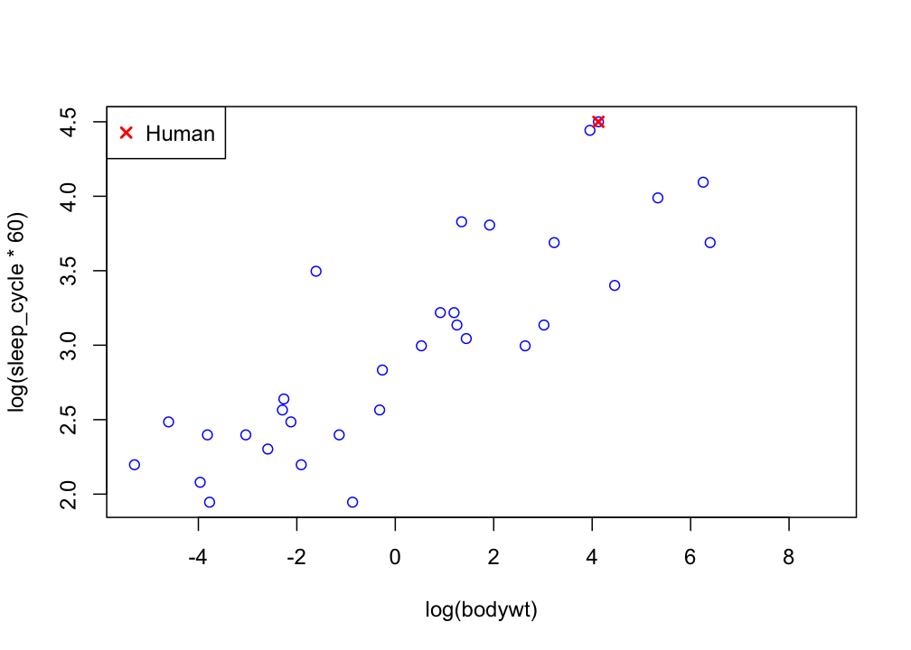
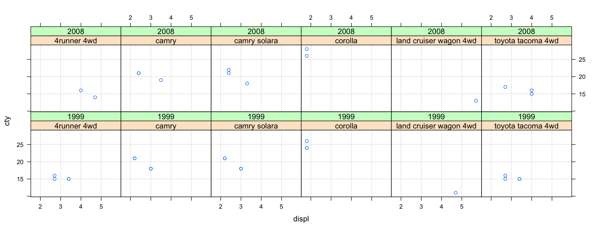
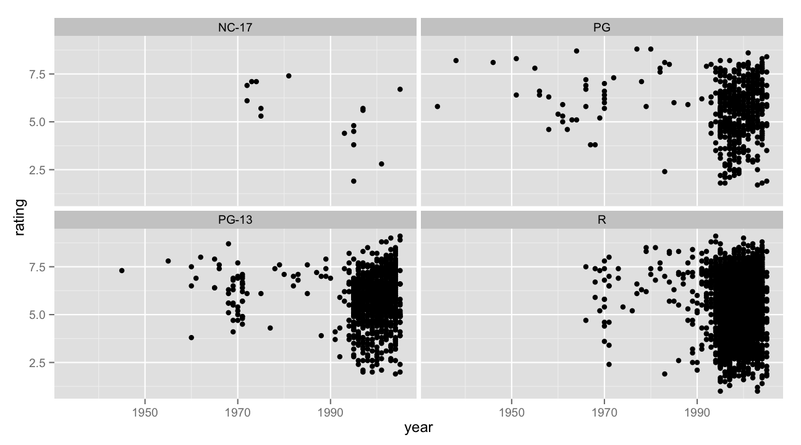
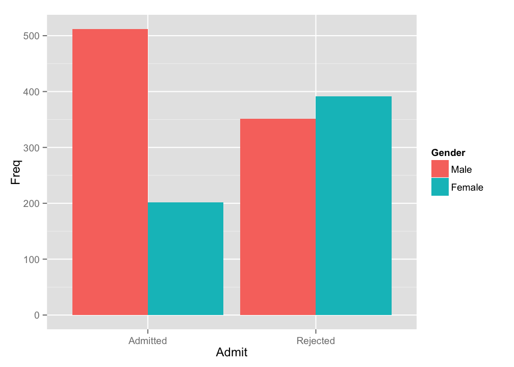
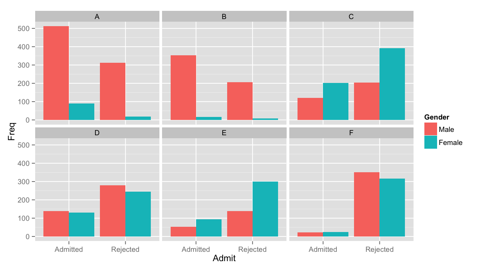

--- 
title       : Exploratory Data Analysis with R
subtitle    : An introduction to R graphics packages
author      : Joshua Galbraith
job         : Chief Data Scientist at Network Redux
framework   : io2012
highlighter : highlight.js
hitheme     : tomorrow
mode        : selfcontained
knit        : slidify::knit2slides
---

## Exploratory Data Analysis (EDA)

<q>
‘Exploratory data analysis’ is an attitude, a state of flexibility, a willingness to look for those things that we believe are not there, as well as those we believe to be there.
</q>
<div class="author">
John Wilder Tukey
</div>

---

## EDA

# Tools

* plots
* graphs
* summary statistics

# Method

* plotting distributions
* plotting time series
* transforming variables
* looking at pairwise relationships
* generating summary statistics

--- &twocol

## John Wilder Tukey (JWT)

*** =left

* taught mathematics and statistics at Princeton
* worked as a mathematician at Bell Labs
* served as a member of the President's Scientific Advisory Committee
* codeveloped Cooley-Tukey FFT algorithm
* coined the terms “bit” and “software”
* introduced the box plot in his book, <em>Exploratory Data Analysis</em>
* is considered the father of EDA and R

*** =right

<blockquote>
“The introduction by Tukey of bits for binary digits has nothing but irresponsible vulgarity to commend it.”
</blockquote>
<cite>
— L. Hogben and M. Cartwright
</cite>

<blockquote>
“Then, in the late 1960s, John Tukey made statistical graphics respectable, putting an end to the view that graphics were only for decorating a few numbers.”
</blockquote>

<cite>
— Edward R. Tufte
</cite>

--- &twocol

## S

*** =left

* S is a statistical computing language designed and implemented by the statistics research departments at Bell Labs in the mid-1970s.

* The commercial software available didn't answer the right questions and could not be modified.

* Existing FORTRAN libraries developed at Bell Labs implemented statistical subroutines but did not offer an easy to use, interactive interface.

*** =right

<blockquote>
“Better to have an approximate answer to the right question than a precise answer to the wrong question.”
</blockquote>
<cite>
— John Tukey
</cite>

<blockquote>
“enabling users to ask the ‘right’ question (and to get a usable answer)  
is the most central design principle behind S”
</blockquote>
<cite>
— John Chambers
</cite>

<blockquote>
“we wanted to be able to interact with our data, using Exploratory Data Analysis techniques”
</blockquote>
<cite>
— Rick Becker
</cite>

---

## R

* A programming language and an environment for statistical computing and graphics
* Created in the 1990s at the University of Auckland by Ross Ihaka and Robert Gentleman 
* Combines S syntax and features with memory management and scoping from Scheme
* Currently developed by a core team including the creators, and S creator John Chambers

<q>
R is popular partly because it presents different faces to different users
</q>

<div class="author">
Sylvia Tippmann in <em>Nature</em>
</div>

---

## anscombe {datasets}


```r
str(anscombe)
```

```
## 'data.frame':	11 obs. of  8 variables:
##  $ x1: num  10 8 13 9 11 14 6 4 12 7 ...
##  $ x2: num  10 8 13 9 11 14 6 4 12 7 ...
##  $ x3: num  10 8 13 9 11 14 6 4 12 7 ...
##  $ x4: num  8 8 8 8 8 8 8 19 8 8 ...
##  $ y1: num  8.04 6.95 7.58 8.81 8.33 ...
##  $ y2: num  9.14 8.14 8.74 8.77 9.26 8.1 6.13 3.1 9.13 7.26 ...
##  $ y3: num  7.46 6.77 12.74 7.11 7.81 ...
##  $ y4: num  6.58 5.76 7.71 8.84 8.47 7.04 5.25 12.5 5.56 7.91 ...
```

---

## Anscombe's Quartet - head()


```r
head(anscombe, 11)
```

```
##    x1 x2 x3 x4    y1   y2    y3    y4
## 1  10 10 10  8  8.04 9.14  7.46  6.58
## 2   8  8  8  8  6.95 8.14  6.77  5.76
## 3  13 13 13  8  7.58 8.74 12.74  7.71
## 4   9  9  9  8  8.81 8.77  7.11  8.84
## 5  11 11 11  8  8.33 9.26  7.81  8.47
## 6  14 14 14  8  9.96 8.10  8.84  7.04
## 7   6  6  6  8  7.24 6.13  6.08  5.25
## 8   4  4  4 19  4.26 3.10  5.39 12.50
## 9  12 12 12  8 10.84 9.13  8.15  5.56
## 10  7  7  7  8  4.82 7.26  6.42  7.91
## 11  5  5  5  8  5.68 4.74  5.73  6.89
```

---

## Anscombe's Quartet - summary()


```r
summary(anscombe)
```

```
##        x1             x2             x3             x4    
##  Min.   : 4.0   Min.   : 4.0   Min.   : 4.0   Min.   : 8  
##  1st Qu.: 6.5   1st Qu.: 6.5   1st Qu.: 6.5   1st Qu.: 8  
##  Median : 9.0   Median : 9.0   Median : 9.0   Median : 8  
##  Mean   : 9.0   Mean   : 9.0   Mean   : 9.0   Mean   : 9  
##  3rd Qu.:11.5   3rd Qu.:11.5   3rd Qu.:11.5   3rd Qu.: 8  
##  Max.   :14.0   Max.   :14.0   Max.   :14.0   Max.   :19  
##        y1               y2              y3              y4        
##  Min.   : 4.260   Min.   :3.100   Min.   : 5.39   Min.   : 5.250  
##  1st Qu.: 6.315   1st Qu.:6.695   1st Qu.: 6.25   1st Qu.: 6.170  
##  Median : 7.580   Median :8.140   Median : 7.11   Median : 7.040  
##  Mean   : 7.501   Mean   :7.501   Mean   : 7.50   Mean   : 7.501  
##  3rd Qu.: 8.570   3rd Qu.:8.950   3rd Qu.: 7.98   3rd Qu.: 8.190  
##  Max.   :10.840   Max.   :9.260   Max.   :12.74   Max.   :12.500
```

---

## Anscombe's Quartet - mean(), var(), and cor()


```
## Source: local data frame [4 x 6]
## 
##   dataset mean_x variance_x   mean_y variance_y correlation_xy
## 1       1      9         11 7.500909   4.127269      0.8164205
## 2       2      9         11 7.500909   4.127629      0.8162365
## 3       3      9         11 7.500000   4.122620      0.8162867
## 4       4      9         11 7.500909   4.123249      0.8165214
```

---

## Anscombe's Quartet - coef() and lm()

<!-- https://github.com/hadley/dplyr/issues/490 -->


```
## Source: local data frame [8 x 5]
## Groups: dataset
## 
##   dataset  Estimate Std..Error  t.value    Pr...t..
## 1       1 3.0000909  1.1247468 2.667348 0.025734051
## 2       1 0.5000909  0.1179055 4.241455 0.002169629
## 3       2 3.0009091  1.1253024 2.666758 0.025758941
## 4       2 0.5000000  0.1179637 4.238590 0.002178816
## 5       3 3.0024545  1.1244812 2.670080 0.025619109
## 6       3 0.4997273  0.1178777 4.239372 0.002176305
## 7       4 3.0017273  1.1239211 2.670763 0.025590425
## 8       4 0.4999091  0.1178189 4.243028 0.002164602
```

---

## Anscombe's Quartet - Plots


---

## The Importance of Graphics for Data Analysis

<q>
The best single device for suggesting, and at times answering, questions beyond those originally posed is the graphical display.
</q>
<div class="author">
JWT
</div>

---

## Tufte's Principles of Analytical Design

1. Show comparisons, contrasts, differences.
2. Show causality, mechanism, explanation, systematic structure.
3. Show multivariate data; that is, show more than 1 or 2 variables.
4. Completely integrate words, numbers, images, diagrams.
5. Thoroughly describe the evidence. Provide a detailed title, indicate the authors and sponsors, document the data sources, show complete measurement scales, point out relevant issues.
6. Analytical presentations ultimately stand or fall depending on the quality, relevance, and integrity of their content.

---
<style>
strong {
  font-weight: bold;
}
</style>

## R Graphics Packages

* Base - R functions for base graphics 
    + additive plot creation
* Lattice - an emphasis on multivariate data
    + single function call for plot creation
* ggplot2 - An implementation of the Grammar of Graphics in R
    + combines additive plot creation with multidimensional conditioning and shared axes
    + implements a consistent interface for mapping data to aesthetic attributes

<em>Generally, functions cannot be mixed and matched between different plotting systems</em>

---

## Graphics Devices

* Screen device
    + Default 
* File devices
    + Bitmap (e.g. jpg, png) is better for a large number of points
    + Vector (e.g. pdf, svg) is better for a small number of points
* Copy plots to a device with `dev.copy()`
* Close a graphics device with `dev.off()`

---

## msleep {ggplot2}


```r
str(msleep)
```

```
## 'data.frame':	83 obs. of  11 variables:
##  $ name        : chr  "Cheetah" "Owl monkey" "Mountain beaver" "Greater short-tailed shrew" ...
##  $ genus       : chr  "Acinonyx" "Aotus" "Aplodontia" "Blarina" ...
##  $ vore        : Factor w/ 4 levels "carni","herbi",..: 1 4 2 4 2 2 1 NA 1 2 ...
##  $ order       : chr  "Carnivora" "Primates" "Rodentia" "Soricomorpha" ...
##  $ conservation: Factor w/ 7 levels "","cd","domesticated",..: 5 NA 6 5 3 NA 7 NA 3 5 ...
##  $ sleep_total : num  12.1 17 14.4 14.9 4 14.4 8.7 7 10.1 3 ...
##  $ sleep_rem   : num  NA 1.8 2.4 2.3 0.7 2.2 1.4 NA 2.9 NA ...
##  $ sleep_cycle : num  NA NA NA 0.133 0.667 ...
##  $ awake       : num  11.9 7 9.6 9.1 20 9.6 15.3 17 13.9 21 ...
##  $ brainwt     : num  NA 0.0155 NA 0.00029 0.423 NA NA NA 0.07 0.0982 ...
##  $ bodywt      : num  50 0.48 1.35 0.019 600 ...
```

---

## The R (Base) Graphics Package - Scatterplot Matrices


```r
plot(msleep[6:11]) # same as pairs(subset(msleep, select = 6:11))
```


--- &twocol

## The R (Base) Graphics Package - Boxplots

*** =left


```r
with(msleep, boxplot(bodywt))
```


*** =right


```r
with(msleep, boxplot(log(bodywt)))
```


--- &twocol

## The R (Base) Graphics Package - Histograms

*** =left


```r
with(msleep, hist(sleep_cycle * 60))
```


*** =right


```r
with(msleep,
     hist(log(sleep_cycle * 60)))
```


---

## The R (Base) Graphics Package - Scatterplots


```r
with(msleep, plot(log(bodywt), log(sleep_cycle * 60)))
```


---

## The R (Base) Graphics Package - Regression Lines


```r
with(msleep, plot(log(bodywt), log(sleep_cycle * 60)))
fit <- lm(log(sleep_cycle * 60) ~ log(bodywt), msleep)
abline(fit)
```


---

## The R (Base) Graphics Package - Annotation


```r
with(msleep,
     plot(x = log(bodywt), y = log(sleep_cycle * 60),
          xlab = 'ln(Body Mass (Kg))', ylab = 'ln(Sleep Cycle Time (min.))'))
```


---

## The R (Base) Graphics Package - Annotation


```r
with(msleep, plot(x = log(bodywt), y = log(sleep_cycle * 60), pch = 1, col = 'blue'))
points(x = log(62), y = log(90), col = 'red', pch = 4, lwd = 2)
legend('topleft', legend = 'Human', col = 'red', pch = 4, pt.lwd = 2)
```



---

## The Lattice Graphics Package


```r
install.packages('lattice')
library('lattice')
```

* Good for plotting high dimensional data
* Faceting a.k.a. conditioning, trellising, or latticing
    + Subset data into panels by one or more variables
* Panel functions can be used to modify the panel content
* Annotate and plot in one call; auto margins and spacing
* Returns an object to be printed to a graphics device

http://lmdvr.r-forge.r-project.org/

---

## mpg {ggplot2}


```r
str(mpg)
```

```
## 'data.frame':	234 obs. of  11 variables:
##  $ manufacturer: Factor w/ 15 levels "audi","chevrolet",..: 1 1 1 1 1 1 1 1 1 1 ...
##  $ model       : Factor w/ 38 levels "4runner 4wd",..: 2 2 2 2 2 2 2 3 3 3 ...
##  $ displ       : num  1.8 1.8 2 2 2.8 2.8 3.1 1.8 1.8 2 ...
##  $ year        : int  1999 1999 2008 2008 1999 1999 2008 1999 1999 2008 ...
##  $ cyl         : int  4 4 4 4 6 6 6 4 4 4 ...
##  $ trans       : Factor w/ 10 levels "auto(av)","auto(l3)",..: 4 9 10 1 4 9 1 9 4 10 ...
##  $ drv         : Factor w/ 3 levels "4","f","r": 2 2 2 2 2 2 2 1 1 1 ...
##  $ cty         : int  18 21 20 21 16 18 18 18 16 20 ...
##  $ hwy         : int  29 29 31 30 26 26 27 26 25 28 ...
##  $ fl          : Factor w/ 5 levels "c","d","e","p",..: 4 4 4 4 4 4 4 4 4 4 ...
##  $ class       : Factor w/ 7 levels "2seater","compact",..: 2 2 2 2 2 2 2 2 2 2 ...
```

---

## The Lattice Graphics Package - xyplot()


```r
xyplot(cty ~ displ | class, data = mpg)
```


---

## The Lattice Graphics Package - xyplot()


```r
xyplot(cty ~ displ | model * as.factor(year),
       data = subset(mpg, manufacturer == 'toyota'), type = c('p', 'g'))
```



---

## The ggplot2 Graphics Package


```r
install.packages('ggplot2')
library('ggplot2')
```

Plots are composed by combining:
* A default dataset and aesthetic mapping
* Layers
    + Geometric objects
    + Statistical transformations
    + Positional adjustments
    + A dataset and aesthetic mapping (optional)
* A scale for each aesthetic mapping 
* A coordinate system
* Faceting

---

## movies {ggplot2}


```r
str(movies[1:12])
```

```
## 'data.frame':	58788 obs. of  12 variables:
##  $ title : chr  "$" "$1000 a Touchdown" "$21 a Day Once a Month" "$40,000" ...
##  $ year  : int  1971 1939 1941 1996 1975 2000 2002 2002 1987 1917 ...
##  $ length: int  121 71 7 70 71 91 93 25 97 61 ...
##  $ budget: int  NA NA NA NA NA NA NA NA NA NA ...
##  $ rating: num  6.4 6 8.2 8.2 3.4 4.3 5.3 6.7 6.6 6 ...
##  $ votes : int  348 20 5 6 17 45 200 24 18 51 ...
##  $ r1    : num  4.5 0 0 14.5 24.5 4.5 4.5 4.5 4.5 4.5 ...
##  $ r2    : num  4.5 14.5 0 0 4.5 4.5 0 4.5 4.5 0 ...
##  $ r3    : num  4.5 4.5 0 0 0 4.5 4.5 4.5 4.5 4.5 ...
##  $ r4    : num  4.5 24.5 0 0 14.5 14.5 4.5 4.5 0 4.5 ...
##  $ r5    : num  14.5 14.5 0 0 14.5 14.5 24.5 4.5 0 4.5 ...
##  $ r6    : num  24.5 14.5 24.5 0 4.5 14.5 24.5 14.5 0 44.5 ...
```

---

## movies {ggplot2}


```r
str(movies[13:24])
```

```
## 'data.frame':	58788 obs. of  12 variables:
##  $ r7         : num  24.5 14.5 0 0 0 4.5 14.5 14.5 34.5 14.5 ...
##  $ r8         : num  14.5 4.5 44.5 0 0 4.5 4.5 14.5 14.5 4.5 ...
##  $ r9         : num  4.5 4.5 24.5 34.5 0 14.5 4.5 4.5 4.5 4.5 ...
##  $ r10        : num  4.5 14.5 24.5 45.5 24.5 14.5 14.5 14.5 24.5 4.5 ...
##  $ mpaa       : Factor w/ 5 levels "","NC-17","PG",..: 1 1 1 1 1 1 5 1 1 1 ...
##  $ Action     : int  0 0 0 0 0 0 1 0 0 0 ...
##  $ Animation  : int  0 0 1 0 0 0 0 0 0 0 ...
##  $ Comedy     : int  1 1 0 1 0 0 0 0 0 0 ...
##  $ Drama      : int  1 0 0 0 0 1 1 0 1 0 ...
##  $ Documentary: int  0 0 0 0 0 0 0 1 0 0 ...
##  $ Romance    : int  0 0 0 0 0 0 0 0 0 0 ...
##  $ Short      : int  0 0 1 0 0 0 0 1 0 0 ...
```

---

## The ggplot2 Graphic Package - Histograms 


```r
gg <- ggplot(movies, aes(x = rating))
gg + geom_histogram(binwidth = .3)
```


---

## The ggplot2 Graphic Package - Histograms 


```r
# gg <- ggplot(movies, aes(x = rating))
gg + geom_histogram(binwidth = .3, aes(weight = votes)) + ylab('votes')
```


---

## The ggplot2 Graphics Package - Density Plots


```r
# gg <- ggplot(movies, aes(x = rating))
gg + geom_density(aes(color = mpaa))
```


---

## The ggplot2 Graphics Package - Density Plots


```r
# gg <- ggplot(movies, aes(x = rating))
gg + geom_density(aes(fill = factor(Documentary)), alpha = .5)
```


---

## The ggplot2 Graphics Package - Scatter Plots


```r
sp <- ggplot(subset(movies, !is.na(budget)), aes(x = year, y = budget))
sp + geom_point() + scale_y_continuous(labels = dollar)
```


---

## The ggplot2 Graphics Package - Scatter Plots


```r
ggplot(subset(movies, mpaa != ''), aes(x = year, y = rating)) +
  geom_point() + facet_wrap(~ mpaa)
```



---

## UCBAdmissions {datasets}


```r
str(UCBAdmissions)
```

```
##  table [1:2, 1:2, 1:6] 512 313 89 19 353 207 17 8 120 205 ...
##  - attr(*, "dimnames")=List of 3
##   ..$ Admit : chr [1:2] "Admitted" "Rejected"
##   ..$ Gender: chr [1:2] "Male" "Female"
##   ..$ Dept  : chr [1:6] "A" "B" "C" "D" ...
```

---

## The ggplot2 Graphics Package - Simpson's Paradox


```r
ggplot(data.frame(UCBAdmissions), aes(x = Admit, y = Freq, fill = Gender)) +
  geom_bar(stat='identity', position='dodge')
```



---

## The ggplot2 Graphics Package - Simpson's Paradox


```r
ggplot(data.frame(UCBAdmissions), aes(x = Admit, y = Freq, fill = Gender)) +
  geom_bar(stat='identity', position='dodge') + facet_wrap(~ Dept)
```



---

## High-Dimensional Data Analysis

# Clustering

* Clustering is one type of method for visualizing high dimensional data.
* It requires defining notions of distance and grouping (merge strategy).
* Outliers, missing data, and difference of scale will affect clustering.

# Dimensionality Reduction

* Dimensionality reduction is a way of reducing the number of variables in a data set.
* This can be accomplished by either subsetting or transforming the original data set.
* Transformations map data from a high dimensional space to a lower dimensional space.

--- .refs

## References

O'Neil, Cathy; Schutt, Rachel. "Statistical Inference, Exploratory Data Analysis, and the Data Science Process." In Doing Data Science: Straight Talk from the Frontline. Sebastopol, Cali.: O'Reilly Media, 2013.

Brillinger, David R. "Feature Articles-John Wilder Tukey (1915-2000)-The author remembers a scientist who discovered the fast Fourier transform, changed the language of statistics, and counseled US presidents." Notices of the American Mathematical Society 49, no. 2 (2002): 193-201.

Becker, Richard A. "A brief history of S." cahier de recherche, AT&T Bell Labora (1994).

Ihaka, Ross. "R: Past and future history." COMPUTING SCIENCE AND STATISTICS (1998): 392-396.

Tippmann, Sylvia. "Programming tools: Adventures with R." Nature 517, no. 7532 (2015): 109-110.

Tufte, Edward R. "The Fundamental Principles of Analytical Design." In Beautiful Evidence. Cheshire, Conn.: Graphics Press, 2006.

Wickham, Hadley. "A layered grammar of graphics." Journal of Computational and Graphical Statistics 19, no. 1 (2010): 3-28.

Peng, Roger D., et. al. "Course materials for the Johns Hopkins Data Science Specialization on Coursera." https://github.com/DataScienceSpecialization/courses/tree/master/04_ExploratoryAnalysis
